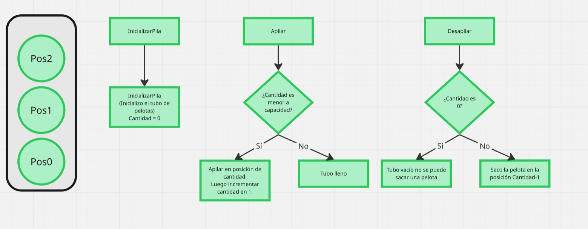

Actividad 1: El contrato del Millón

Para el punto vamos a tener en cuenta un sistema que maneje las pelotas de tenis dentro de un tubo, el mismo contiene 3 espacios y un solo orificio de entrada, por tanto para que las pelotas puedan entrar y salir están relacionadas y supeditadas una con otra.

En este caso se forma una fila, la primer pelota en entrar al tubo queda en la parte inferior, la segunda en el lugar del medio y finalmente la tercera en la ultima posición (superior). 

Esto termina resultando el un PILA, debido a que la útima en ingresar es la primera en salir. A su vez con la salida y entrada de cada pelota se reposicionan el resto para ir manteniendo esta dinámica.

Actividad 2: Guerra de Estrategias

Nos volcamos por la primer implementación, Un arreglo y una variable externa auxiliar que nos permita tener el control de la primer posición libre.

Si tenemos en cuenta la complejidad del problema a solucionar con el sistema, las otras 2 opciones se vuelven en cierta posición inviables por su complejidad, la prioridad en este sistema es que las pelotas ocupen y desocupen rápidamente su lugar.

