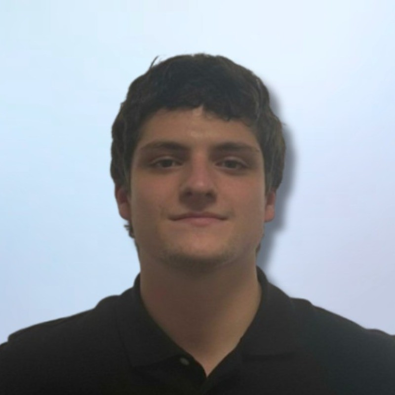
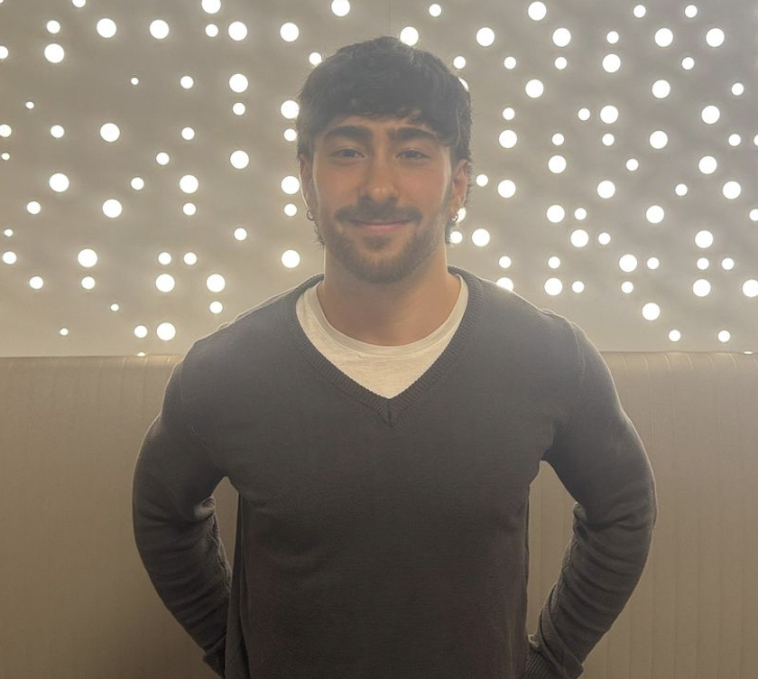
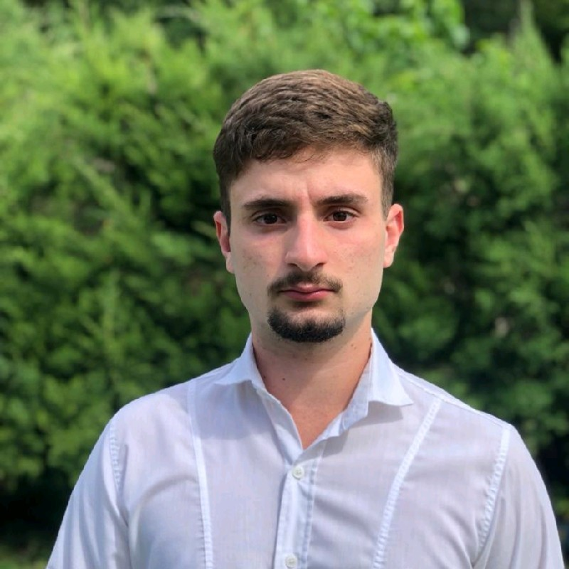
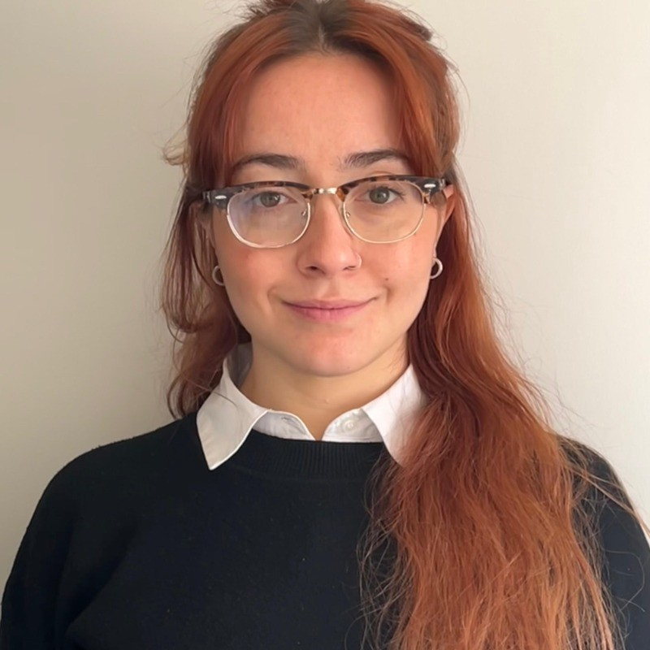
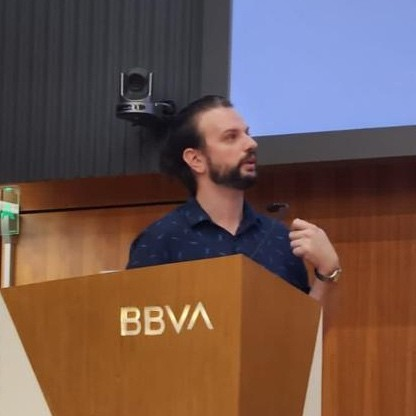

# 📘 README – Programación 2

## 👥 Integrantes del equipo

---

## 🧑‍💻 Integrante 1

- **Nombre:** Nicolás Aversa  
- **Usuario GitHub:** @nicolas-aversa  
- **Correo:** naversa@uade.edu.ar  
- **LinkedIn:** linkedin.com/in/n-aversa/  

---

## 🧑‍💻 Integrante 2

- **Nombre:** Ezequiel Castelnuovo  
- **Usuario GitHub:** @ezequielcastelnuovo  
- **Correo:** ecastelnuovo@uade.edu.ar  
- **LinkedIn:** linkedin.com/in/ezequielcastelnuovo/  

---

## 🧑‍💻 Integrante 3

- **Nombre:** Valentino Virzi  
- **Usuario GitHub:** @Vvirzi  
- **Correo:** vvirzi@uade.edu.ar  
- **LinkedIn:** linkedin.com/in/valentino-virzi  

---

## 🧑‍💻 Integrante 4

- **Nombre:** Caterina Turdo  
- **Usuario GitHub:** @cate7173  
- **Correo:** cturdo@uade.edu.ar  
- **LinkedIn:** linkedin.com/in/caterina-turdo-190320129/  

---

## 🧑‍💻 Integrante 5

- **Nombre:** Guido Botta  
- **Usuario GitHub:** @Guido-c66  
- **Correo:** gbotta@uade.edu.ar  
- **LinkedIn:** linkedin.com/in/guido-b-b86b33305/  
